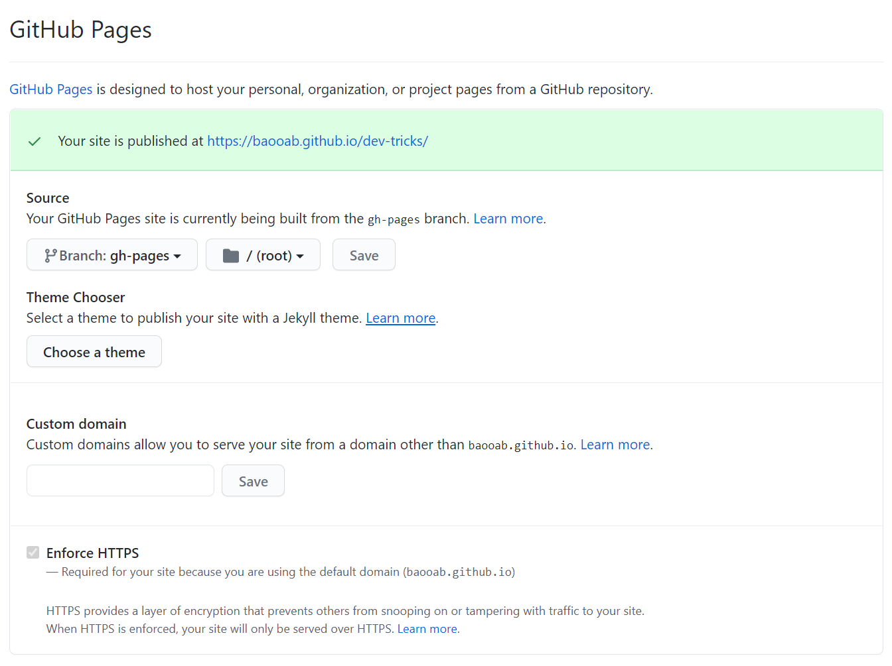

# 如何将 VitePress 部署到 GitHub Pages

::: tip 目录
[[toc]]
:::

VitePress 基于 Vite 构建，比 VuePress 好的一点就是快，因为 Vite 是基于 Rollup.js 构建，VuePress 则是基于 webpack 构建。

根据官方 [Getting Started][1] 和 [Deploying][2] 两节内容就能达到 90% 的完成度，本文就是为了讲清楚剩下的 10%——也就是部署的坑点所在。

::: tip 提示
本文没有介绍如何接入 Travis CI，有兴趣的同学可以自行尝试。
:::

## 网站配置

我的配置脚本是直接基于 [VitePress 官方文档使用的配置][3] 修改的。

```js
module.exports = {
  lang: "zh-CN",
  base: "/dev-tricks/",
  title: "Dev Tricks",
  description: "dev tricks about web",

  themeConfig: {
    repo: "baooab/dev-tricks",
    docsDir: "docs",

    editLinks: true,
    editLinkText: "在 GitHub 上编辑此页",
    lastUpdated: "最近更新",

    sidebar: {
      "/": getGuideSidebar(),
    },
  },
};

function getGuideSidebar() {
  return [
    {
      text: "最近更新",
      children: [
        {
          text: "如何将 VitePress 部署到 GitHub Pages",
          link: "/git/vitepress-deploy-to-github",
        },
      ],
    },
  ];
}
```

## 新建 gh-pages 分支

为你的仓库创建 GitHub Pages 时，通常需要指定一个仓库分支，一般分支约定名称是 `gh-pages`，这里面存放编译好之后，可直接部署的静态文件。

因此我们先要本地创建一个 `gh-pages` 分支，然后 push 到 Github 仓库中。

```bash
git checkout -b gh-pages
git push
```

接下来，在仓库设置（Settings）里开启 GitHub Pages。



分支选择 `gh-pages`，目录选择根目录就行。

## 发布内容到 Github `gh-pages` 分支

如何将内容发布到到 Github `gh-pages` 分支呢？

```bash
## 保存更改
git add .
git ci -m "your commit message"
git push

# 执行发布脚本
# ./deploy.sh 或者
deploy.sh
```

`depoy.sh` 脚本内容如下：

```bash
#!/usr/bin/env sh

# abort on errors
set -e

# build
npm run docs:build

# navigate into the build output directory
cd docs/.vitepress/dist

# if you are deploying to a custom domain
# echo 'www.example.com' > CNAME

git init
git add -A
git commit -m 'deploy'

# if you are deploying to https://<USERNAME>.github.io
# git push -f git@github.com:<USERNAME>/<USERNAME>.github.io.git master

# if you are deploying to https://<USERNAME>.github.io/<REPO>
git push -f git@github.com:baooab/dev-tricks.git master:gh-pages

cd -
```

这段脚本是修改自 [官方文档里给的][2]，只是配置了下推送的远程仓库地址：

```bash
git push -f git@github.com:baooab/dev-tricks.git master:gh-pages
```

现在打开 [baooab.github.io/dev-tricks/][4] 站点，就能看到刚才发布的内容啦。

::: warning 注意
注意虽然现在 Github 默认分支改成 `main` 了，但是 push 时还是要使用 `master:gh-pages` 推更改到 `gh-pages` 分支上去，而不是 ~~`main:gh-pages`~~。
:::

（完）

[1]: https://vitepress.vuejs.org/guide/getting-started.html
[2]: https://vitepress.vuejs.org/guide/deploy.html#github-pages
[3]: https://github.com/vuejs/vitepress/blob/master/docs/.vitepress/config.js
[4]: https://baooab.github.io/dev-tricks/
